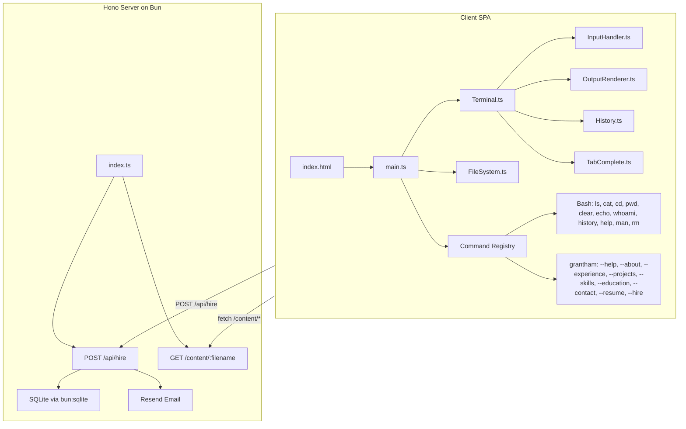

# Terminal Resume Website — Implementation Plan

## Architecture Overview



## Phase 1: Project Scaffolding

Initialize Bun project and install dependencies.

- `bun init` and configure `package.json` with scripts (`dev`, `build`, `start`)
- Install dependencies: `hono`, `resend`
- Configure `[tsconfig.json](tsconfig.json)` with strict mode, DOM lib for client, path aliases
- Configure `[bunfig.toml](bunfig.toml)` if needed
- Create the full directory structure per [requirements section 2.1](docs/requirements.md)
- Create `.env.example` with the four required env vars (`RESEND_API_KEY`, `NOTIFICATION_EMAIL`, `DATABASE_PATH`, `PORT`)
- Create `.gitignore` (node_modules, dist, .env, .db)

## Phase 2: Server (Hono + SQLite + Resend)

Build the backend API first so the client has endpoints to hit.

`**src/server/index.ts**` — Hono app entry point:

- Serve static files from `public/` and built client assets
- Mount API routes, start on `PORT` env var (default 3000)

`**src/server/db.ts**` — SQLite setup:

- Open/create SQLite DB at `DATABASE_PATH`
- Run `CREATE TABLE IF NOT EXISTS hire_inquiries (...)` on startup (schema from section 11.3)

`**src/server/routes/hire.ts**` — `POST /api/hire`:

- Validate `company` (required, 1-200 chars) and `email` (regex format check)
- Rate limit: query DB for count where `ip = ? AND created_at > datetime('now', '-1 hour')`, reject if >= 3
- Insert row into `hire_inquiries`
- Send email via Resend, update `email_sent` column
- Return appropriate status codes (200, 400, 429, 500)

`**src/server/email.ts**` — Resend integration:

- Initialize Resend client with `RESEND_API_KEY`
- `sendHireNotification(company, email, ip)` function
- Subject: `New Hire Inquiry from <company>`

**Content serving** — `GET /content/:filename`:

- Serve markdown files from `src/content/` directory
- Validate filename against allowed list to prevent directory traversal

## Phase 3: Client HTML, CSS, and Layout

`**src/client/index.html`:

- Meta tags and Open Graph tags (section 12)
- Load Cascadia Code font (CDN or self-hosted)
- Favicon (DG initials)
- Single `<div>` mount point
- Desktop layout: avatar/identity panel (left, ~1/3) + terminal panel (right, ~2/3)
- Mobile layout (< 768px): stacked — avatar centered above, terminal fills remaining viewport

`**src/client/styles/main.css`:

- One Half Dark color palette (section 4.1): page bg `#000000`, terminal bg `#282c34`, etc.
- Typography: `Cascadia Code` at 14-15px, line-height 1.4-1.5, ligatures enabled
- Terminal chrome: no title bar, optional 2-4px border-radius
- Avatar: `border-radius: 50%`, 120-150px desktop, 100px mobile
- Identity panel text styles (name bold/white, title muted, email blue link)
- Terminal: `overflow-y: auto`, `height: 100%` of its container, no page scroll (`html, body { overflow: hidden; height: 100vh }`)
- Responsive breakpoint at 768px (flexbox row -> column)
- ANSI color utility classes: `.ansi-red`, `.ansi-green`, `.ansi-yellow`, `.ansi-blue`, `.ansi-magenta`, `.ansi-cyan`
- Blinking cursor animation
- Link styles: blue `#61afef`, underline on hover
- Ghost text style: `color: #5c6370`

## Phase 4: Terminal Engine

The core interactive terminal UI — all in `src/client/terminal/`.

`**Terminal.ts` — Main orchestrator:

- Creates the terminal DOM structure (output container + input line)
- Manages prompt rendering (line 1: colored segments, line 2: input with cursor)
- Delegates to InputHandler, OutputRenderer, History, TabComplete
- Tracks session state (ghost text dismissed, command history list)
- Ensures focus always returns to input on click

`**InputHandler.ts` — Keyboard/input management:

- Captures keydown events on a hidden `<input>` or `contenteditable` element
- Enter -> execute command (pass to registry)
- Backspace -> delete char
- Up/Down -> delegate to History
- Tab -> delegate to TabComplete
- Ctrl+C -> cancel input, new prompt
- Ctrl+L -> clear
- Disable input while output is streaming (flag from OutputRenderer)

`**OutputRenderer.ts` — Streaming text renderer:

- `stream(content: string | StyledSpan[], speed?: number)` -> streams character-by-character at 5-15ms intervals
- Returns a Promise that resolves when streaming completes
- Auto-scrolls terminal to bottom during streaming
- Supports styled spans (colored text, bold, links)
- `print(content)` for instant output (errors, prompts)

`**History.ts` — Command history:

- Stores commands in array, tracks cursor index
- `push(cmd)`, `prev()`, `next()`, `getAll()` methods
- Up arrow returns previous, down arrow returns next or empty string

`**TabComplete.ts` — Tab completion:

- Given partial input, context (command vs. argument), and current directory
- Command completion: match against registered command names
- Filename completion after `cat`/`cd`: match against current directory entries
- Flag completion after `grantham -`: match against known flags
- Double-tab lists all matches

## Phase 5: Virtual Filesystem

`**src/client/filesystem/types.ts`:

- `FileNode` type: `{ name, type: 'file' | 'directory', content?: string, children?: FileNode[] }`

`**src/client/filesystem/FileSystem.ts`:

- Initialize tree structure mirroring section 6.1:

```
  /home/user/ (aliased as ~)
  ├── about.md, experience.md, skills.md, education.md, contact.md, resume.pdf
  └── projects/ (project-1.md, project-2.md, ...)


```

- `cwd` tracking (starts at `/home/user`)
- `resolve(path)` — resolve relative/absolute path to node
- `ls(path?)` — list directory contents
- `cd(path)` — change directory, return success or error
- `cat(path)` — return file content or error
- `pwd()` — return current working directory string
- Content loaded lazily via `fetch('/content/<filename>')` on first access, then cached

## Phase 6: Command System

`**src/client/commands/registry.ts**`:

- Map of command name -> handler function
- Handler signature: `(args: string[], context: CommandContext) => Promise<CommandResult>`
- `CommandContext` includes: filesystem, terminal (for interactive prompts), history
- `CommandResult`: array of styled output spans or void
- Detect and reject command chaining (`|`, `&&`, `;`)

`**src/client/commands/bash/**` — One file per command:

- `ls.ts` — list directory, green for dirs, default for files
- `cat.ts` — read file content, stream to terminal; handle errors (missing operand, no such file, is a directory)
- `cd.ts` — change directory; handle errors (no such dir, not a directory)
- `pwd.ts` — print working directory
- `clear.ts` — clear terminal output
- `echo.ts` — print args joined by spaces
- `whoami.ts` — print "Daniel Grantham"
- `history.ts` — print numbered command list
- `help.ts` — list all registered commands with descriptions
- `man.ts` — if arg is "grantham", alias to `grantham --help`; else "No manual entry for X"
- `rm.ts` — if args contain `-rf /`, print "Good try."; else "rm: command not supported"

`**src/client/commands/grantham/**`:

- `index.ts` — parse flags, route to subcommand handler
- `help.ts` — print usage block, dismiss ghost text
- `about.ts`, `experience.ts`, `projects.ts`, `skills.ts`, `education.ts`, `contact.ts` — fetch + render markdown content
- `resume.ts` — interactive Y/n prompt, trigger file download
- `hire.ts` — interactive multi-step prompt (company -> email -> POST /api/hire)

## Phase 7: Markdown-to-Terminal Renderer

Utility module `src/client/terminal/MarkdownRenderer.ts`:

- Parse markdown into styled terminal output spans per section 10.3:
  - `# Heading` -> UPPERCASE bold + `═` underline
  - `## Subheading` -> bold + `─` underline
  - `- bullet` -> `• bullet`
  - `**bold**` -> bold span
  - `[text](url)` -> clickable blue link
  - `code` -> yellow highlighted span
  - Paragraph separation via blank lines

## Phase 8: Content Files

Create placeholder markdown files in `src/content/`:

- `about.md` — Bio/summary
- `experience.md` — Chronological work history
- `projects.md` — Project portfolio
- `skills.md` — Categorized technical skills
- `education.md` — Degree(s) and institution(s)
- `contact.md` — Email, LinkedIn, GitHub links

These will contain placeholder text that can be filled in with real content later.

## Phase 9: Build Configuration and Static Assets

- Configure Bun to bundle the client TypeScript into a single JS file for production
- Server serves `index.html` + bundled JS + CSS + public assets
- Add build script to `package.json`
- Create favicon files (DG initials, `.ico` and `.svg`)
- Add `public/` directory for `avatar.jpg`, `resume.pdf` (placeholders)

## Phase 10: Easter Eggs and Polish

- `sudo` handling: "command not found" or "Permission denied."
- `rm` variants per section 13
- Ghost text: render on first load, dismiss after `grantham --help` or `man grantham`
- Verify all error messages match section 7.3 exactly
- Performance: ensure LCP < 1.5s, TTI < 2s (minimal dependencies help here)

## Key Implementation Notes

- **No frameworks** — the client is vanilla TypeScript manipulating the DOM directly
- **Bun serves both the API and the static client** — single process deployment
- **Content is fetched from the server at runtime**, not bundled into the client JS (allows updating content without rebuilding)
- **The virtual filesystem is client-side only** — it models the structure and lazily fetches file contents from `/content/:filename`
- **Interactive prompts** (`--resume`, `--hire`) temporarily replace the normal input handler with a prompt-specific handler that collects answers step-by-step
